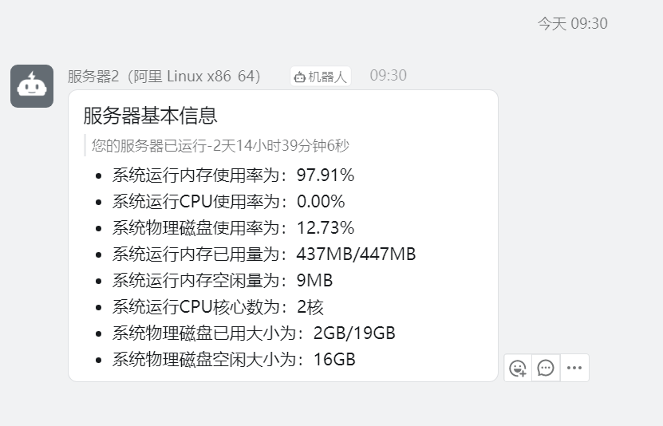
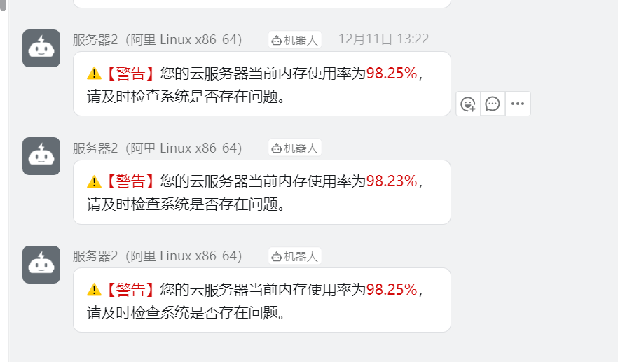

# ServerWatcher-DingBot-Go
### 钉钉机器人服务器监控-Go版本
#### 一、说明
- 支持Windows、支持Linux各种架构
- 支持定时推送服务器状态、内存告警、Cpu飙高告警、负载率告警
- 参考https://github.com/tyza66/ServerWatcher-DingBot

推送效果

告警效果

#### 二、使用方法
1、下载源代码  
2、修改dingding机器人token和加签信息  
3、修改推送时间和告警阈值等  
4、编译对应平台程序  

#### 三、其他
- Linux下可制作`/etc/systemd/system`下的service文件，实现开机自启动和守护进程

By:tyza66
